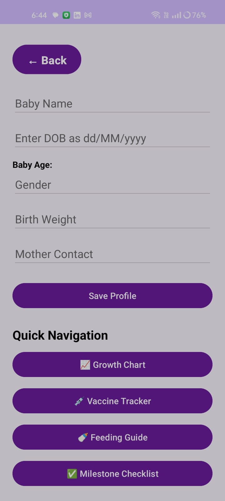
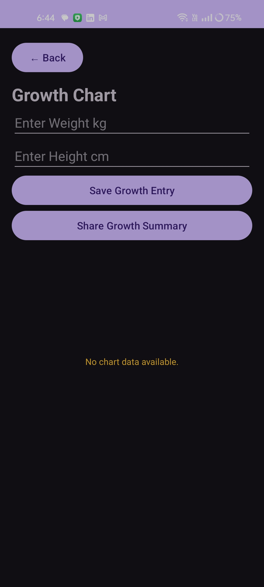
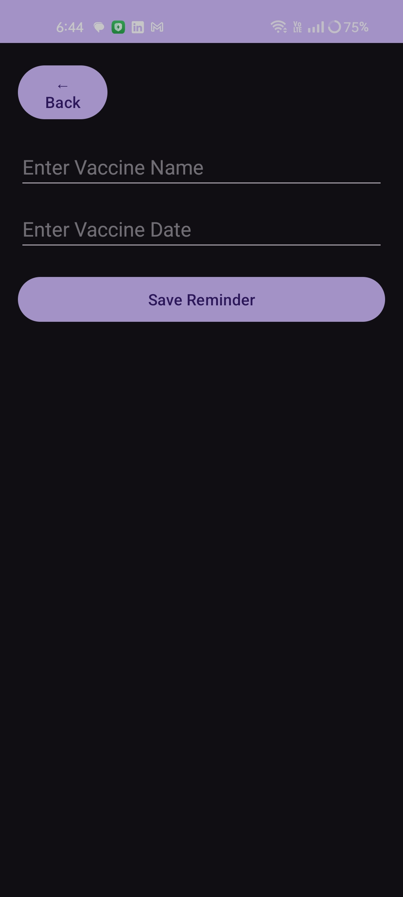
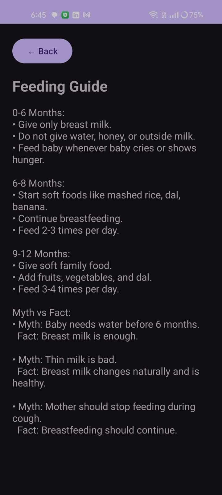
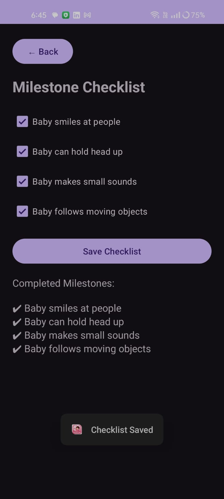

# Shishu-Sneh – Baby’s First Year Digital Companion

Shishu-Sneh is a healthcare-focused Android application developed to support new mothers in rural and semi-urban India by helping them monitor infant growth, vaccination schedules, feeding guidance, and developmental milestones.

The application acts as a digital companion for a baby’s first year with an accessible and mother-friendly interface.

---

## Problem Statement

Many mothers miss vaccination dates, cannot track infant growth properly, and lack access to developmental guidance after hospital discharge.

Shishu-Sneh addresses these challenges through a simple healthcare companion application.

---

## Features

### Baby Profile Management
- Store baby details
- Date of birth tracking
- Gender details
- Mother contact information

### Growth Chart Tracker
- Weight tracking
- Height tracking
- Monthly growth monitoring
- MPAndroidChart line graph visualization
- Growth summary sharing

### Vaccination Tracker
- Upcoming vaccination list
- Due date reminders
- Vaccine completion tracking
- WorkManager notification alerts
- Overdue vaccine indication

### Feeding Guide
- Age-based feeding tips
- Nutrition recommendations
- Breastfeeding guidance
- Myth vs Fact section

### Milestone Checklist
- Weekly development tracking
- Age-based milestone questions
- Yes / No responses
- Development advisory guidance

---

## Tech Stack

Language: Kotlin

UI:
- XML Layouts
- Material Design 3

Architecture:
- MVVM Architecture
- Repository Pattern
- LiveData

Database:
- Room Database

Background Services:
- WorkManager
- AlarmManager

Charts:
- MPAndroidChart

IDE:
- Android Studio

---

## Project Structure

```bash
app/
gradle/
build.gradle.kts
settings.gradle.kts
gradlew
## Installation

### Clone Repository

```bash
git clone https://github.com/poornahr1812-lang/ShishuSneh-Android-App.git
```

### Open in Android Studio

1. Open Android Studio

2. Click **Open Project**

3. Select the downloaded **ShishuSneh-Android-App** folder

4. Wait for Gradle synchronization

---

### Configure Project

Ensure required dependencies are installed automatically during Gradle sync.

Libraries used:

- Room Database
- WorkManager
- MPAndroidChart
- Material Design Components

---

### Build and Run

1. Connect Android Emulator / Physical Device

2. Click **Run ▶**

3. Install and launch application

---

### Requirements

- Android Studio
- Kotlin
- Android SDK 24+
- Gradle
- Emulator / Android Device
## Contributions

Contributions, suggestions, and improvements are always welcome.

Feel free to fork this repository, raise issues, or submit pull requests to help improve **Shishu-Sneh** for better maternal and infant healthcare support.

Contributions can include:

- UI / UX improvements
- Vaccine reminder enhancements
- Growth chart improvements
- Feeding guide updates

- Notification optimization
- Feature additions
- Bug fixes
- Performance improvements
Together we can make **Shishu-Sneh** a better digital companion for mothers and infants.
## Application Screenshots

### Home Screen


### Growth Chart


### Vaccine Tracker


### Feeding Guide


### Milestone Checklist

